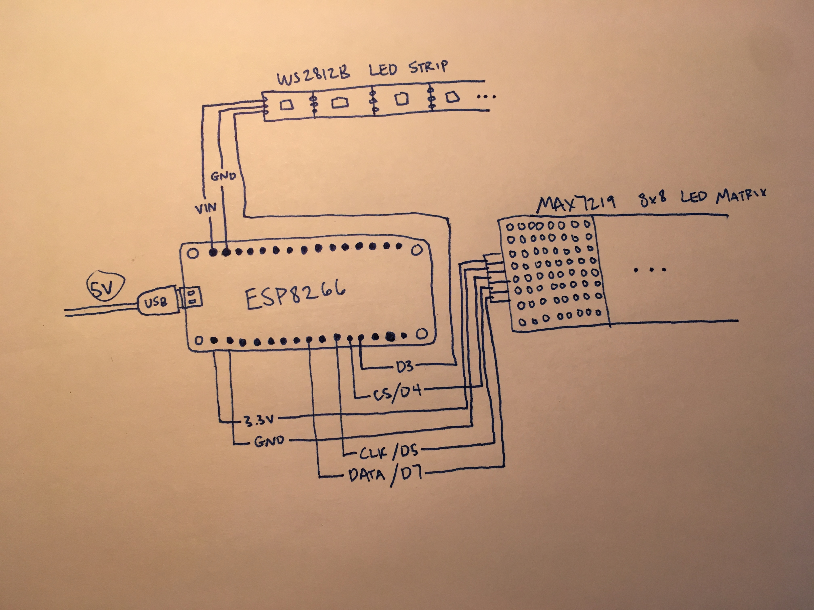
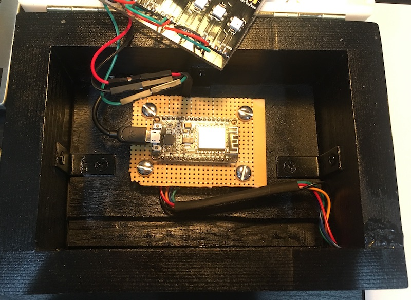

# ESP8266-Ticker

This project uses a simple ESP8266 WiFi microchip to poll financial data in real time -- displaying prices on a MAX7219 LED matrix reminiscent of a digital stock ticker. Additionally, there is a WS2812B LED strip inside the project enclosure that illuminates a translucent acrylic cap. 

This always reports Bitcoin price in real time and also tracks major financial indices, representing futures data if the corresponding market is not open. 

This is a personal project of mine that I built mostly for fun, but I want to open source it in case anyone might find it useful. I will be maintaining the project here as I add more indices and customization features, as well as LED animations to represent price movements in especially volatile markets such as those backed by cryptocurrencies.

## Schematic

One outstanding issue with how this project is currently wired up is that the ESP8266 is being powered by a 5V power supply when it actually requires just 3.3V. This is definitely not good practice, but for now the chip has not been fried! You should probably use a voltage regulator to accomplish this reduction for the ESP8266, while still taking advantage of the full 5V power in for the LED strip.

Here's how I have everything set up inside the enclosure... Doesn't tell you much, but the schematic above should explain all connections.

